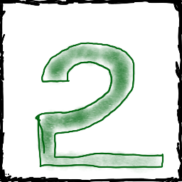
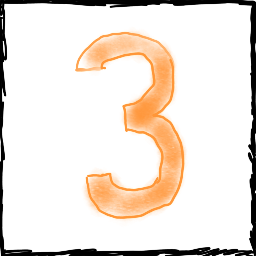
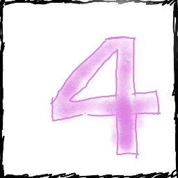
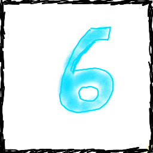
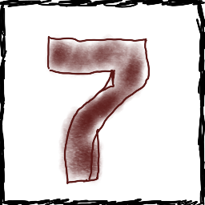
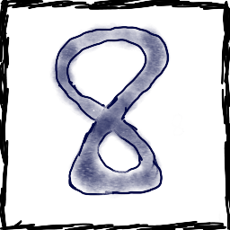
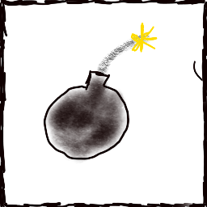
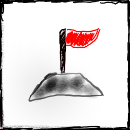
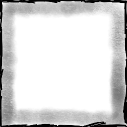
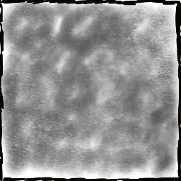

# Client  

The client for the minesweeper will be made with react and the as of right now the only supported pages which will be implemented are the: firstly and most importantly the classical game of minesweeper with 100 mines on a (30x16) grid. The origianl game on microsoft game with smaller and less chalenging sizes however this wont be needed as the intended players for mine are all GIGACHADs.

## Prototype page  

The prototype main page of the minesweeper will look something close to this. The actual game will be slightly different e.g. the size of the grid will be larger I can't be asked to copy and paste over 300 times.  

 .  

## Assets  

These are all the assets that will be used in the game.

*  The asset for 1 cell.  
*  The asset for 2 cell.
*  The asset for 3 cell.
*  The asset for 4 cell.
*  The asset for 5 cell.
*  The asset for 6 cell.
*  The asset for 7 cell.
*  The asset for 8 cell.
*  The asset for a mine.
*  The asset for a marker/flag.
*  The asset for the start/restart button.
*  The asset for an unrevealed cell.
*  The asset for an empty cell.

### Digit assets

In the future it might be beneficial to have digit assets to update the score and time however this is not as of yet implemented or started.
